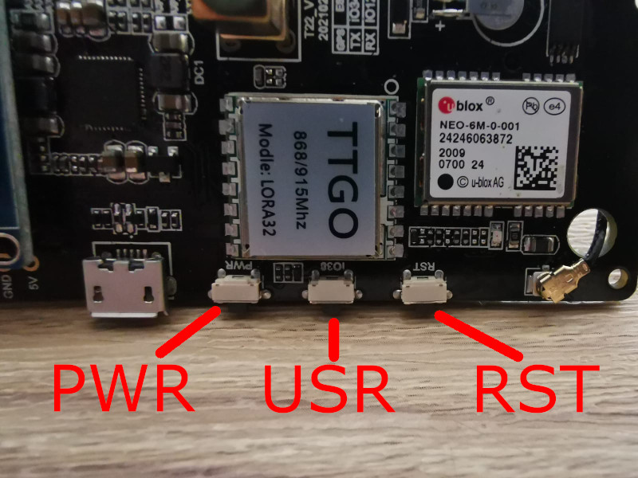
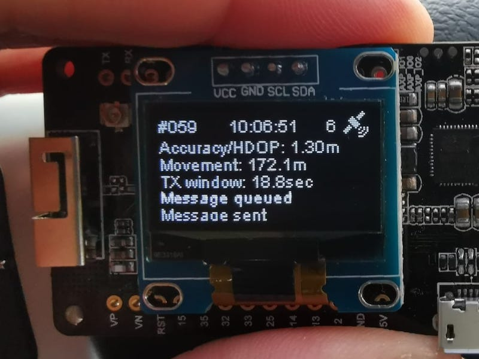

<!-- ## TTGO T-Beam Tracker for The Things Network and/or The Helium Network  -->
## TTGO T-Beam Tracker for use with a LoRaWan Network (Helium)

Minor modifications added by [Max-Plastix](https://github.com/Max-Plastix/tbeam-helium-mapper/):
The Payload Port and contents have been changed to match that in common use by CubeCell mappers: 
Lat, Long, Altitude, Speed, Battery, Sats.  This common decoder function can now be used for both mappers:

```
// From https://github.com/hkicko/CubeCell-GPS-Helium-Mapper
function Decoder(bytes, port) {
  var decoded = {};
  
  var latitude = ((bytes[0]<<16)>>>0) + ((bytes[1]<<8)>>>0) + bytes[2];
  latitude = (latitude / 16777215.0 * 180) - 90;
  
  var longitude = ((bytes[3]<<16)>>>0) + ((bytes[4]<<8)>>>0) + bytes[5];
  longitude = (longitude / 16777215.0 * 360) - 180;
  
  switch (port)
  {
    case 2:
      decoded.latitude = latitude;
      decoded.longitude = longitude; 
      
      var altValue = ((bytes[6]<<8)>>>0) + bytes[7];
      var sign = bytes[6] & (1 << 7);
      if(sign) decoded.altitude = 0xFFFF0000 | altValue;
      else decoded.altitude = altValue;
      
      decoded.speed = parseFloat((((bytes[8]))/1.609).toFixed(2));
      decoded.battery = parseFloat((bytes[9]/100 + 2).toFixed(2));
      decoded.sats = bytes[10];
      decoded.accuracy = 2.5; // Bogus Accuracy required by Cargo/Mapper integration
      break;
  }
     
  return decoded;  
}
```

The DevEUI is auto-generated by the device, and printed in the debug output to import into Helium's Console.


-------------
This well thought out README, original code, and the prior versions of code all have great people behind this and I have only sought to copy and revise it further for my own personal amusement and esthetics. 
Here are the changes to the code:
  - Added Helium Startup Logo
  - Changed App Name and Version of device to reflect more of a device name and number scheme.
  - Changed Text output to reflect Helium, and not TTN (Code referances ttn, just to prevent brakes in this awesome code)
  - Changed credentials file to use OTAA by default.
  - Changed GPS metric output text "Error", to "Accuracy/HDOP".
      
In no way do I claim to have created this code, or own it. 
Proper gratitude is given to all that has worked on this before; and I am just the person that drunk the bottled water sitting on the throne. 
The next person may edit and make this even greater, and hopefuly TLDR with proper credits.
-Fizzy

Same as Fizzy I have not done any of the coding. My only idea with this fork is to make it easier for Newbies like me.
    - Removing TTN references as it confused me
    - Adding instructions where I found it hard to figure it out eg. Libraries
    - Corrected some file edit paths

-------------

Further modifications added by [tmiklas](https://github.com/tmiklas/tbeam-helium-mapper):

**2021-11-18** - Introducing **distance target** mode (a.k.a. TX window scaling)

Verison: `1.1-tm`

Most mappers usually operate in **time target** mode, where they send data to network every set interval (i.e. `SEND_INTERVAL`). There is however a different use case for fast moving mappers - like in a car at motorway speeds...

This feature allows you to switch mapping mode from time target to distace target and back. You can configure your desierd distance target in `configuration.h` and turn ON/OFF by pressing the `USR` button for over 1sec:

```
#define DISTANCE_TARGET          200.0     // MUST be decimal number; distance target in meters
```



Once moving, you will be able to see it operating properly and reporting TX window:



In simple terms, with distance target set to 200m (as default in this code), window scaling starts working once you travel at speed over 10m/s (36k/h or 22.3mph). There's also a lower limit - do not transmit more often than every 2sec... so with 200m target you are good up to 100m/s (360k/h or 223mph) - good luck :-P

**2021-11-14** - Added some new features

Verison: `1.0-tm`

> Send Now - transmit on deman by short-pressing 2nd button

Reacts to short-press of the central button and overrides any travel distance requirement (see 2 below).
Intended for use when you are just skimming the hex you want to light up and don't want to or can't wait
for the usual 30sec cycle.

> Not moving, not transmitting (configurable)

Normally mapper sends location every 30sec, but if you are stationary, there location doesn't change (except possible GPS drift), so ongoing transmissions makes little if any sense, only burns DC. To avoid that, mapper will no longer report position every cycle unless it is actually moving or once every N cycles if stationary to say it's still alive and working.

This is controlled by 2 variables in `configuration.h` file, `MIN_DIST` and `STATIONARY_TX_INTERVAL`.

Example:

```
#define SEND_INTERVAL           (20 * 1000)     // Sleep for these many millis

// -----------------------------------------------------------------------------
// LoRa send criteria
// -----------------------------------------------------------------------------
#define MIN_DIST                 50.0      // MUST be decimal number; minimum distance in meters from the last sent location before we can send again. A hex is about 340m, divide by this value to get the pings per hex.
#define STATIONARY_TX_INTERVAL   60        // If stationary the LoRa frame will be sent once every N cycles... with 20sec cycle, interval of 60 means to transmit once every 20min

```

With the default cycle time of 30sec means that mapper will transmit location if:

- it has moved at least 50m from previously transmitted coordinates,
- when it was stationary for 60 cycles (or 30 minutes),
- ... or user short-pressed 2nd button, which ignores distance/time requirements


-------------
Ref: https://github.com/helium/longfi-arduino/tree/master/TTGO-TBeam-Tracker

This code was originally developed for use on The Things Network (TTN) it has been editied/repurposed for use with the Helium Network.

This TTGO device application uploads GPS data from the TTGO T-Beam to be used for tracking and determining signal strength of LoRaWAN gateways and nodes. When using the device and application on the Helium Network one can contribute to the [Helium Network](https://www.helium.com) Mapper or Cargo projects. Details for the Mapper project can be found [here](https://mappers.helium.com/) and details for Cargo can be found [here](https://cargo.helium.com/)

Current version: 1.2.1

#### This version is based on a forked repo from github user [kizniche] https://github.com/kizniche/ttgo-tbeam-ttn-tracker. Which in turn is based on the code from [xoseperez/ttgo-beam-tracker](https://github.com/xoseperez/ttgo-beam-tracker), with excerpts from [dermatthias/Lora-TTNMapper-T-Beam](https://github.com/dermatthias/Lora-TTNMapper-T-Beam) to fix an issue with incorrect GPS data being transmitted to the network. Support was also added for the 915 MHz frequency (North and South America). [lewisxhe/TTGO-T-Beam](https://github.com/lewisxhe/TTGO-T-Beam) was referenced for enabling use on the newer T-Beam board (Rev1).

This is a LoRaWAN node based on the [TTGO T-Beam](https://github.com/LilyGO/TTGO-T-Beam) development platform using the SSD1306 I2C OLED display.
It uses a RFM95 by HopeRF and the MCCI LoRaWAN LMIC stack. This sample code is configured to connect to The LoRaWan network using the US 915 MHz frequency by default, but can be changed to EU 868 MHz.

NOTE: There are now 2 versions of the TTGO T-BEAM, the first version (Rev0) and a newer version (Rev1). The GPS module on Rev1 is connected to different pins than Rev0. This code has been successfully tested on REV0, and is in the process of being tested on REV1. See the end of this README for photos of each board.

### Setup

1. Install VisualStudio Code (https://code.visualstudio.com/)

2. Add the PlattformIO extension within VS Code (https://platformio.org/install/ide?install=vscode)

3. Check Device Manager if a serialdevice appear on conntecting the T-Beam. If nothing appears a driver for the USB to serial Adpater need to be installed.(https://www.silabs.com/developers/usb-to-uart-bridge-vcp-drivers)

3. Check and edit platformio.ini to use the right bandplan for your region.

4. Edit this project file from Arduino IDE ```main/configuration.h``` under the **Configuration** section and select your correct board revision, either T_BEAM_V07 or T_BEAM_V10 (see [T-BEAM Board Versions](#t-beam-board-versions) to determine which board revision you have).

5. Within your project edit ```main/credentials.h``` to add the device OTAA keys, ```Device EUI, App EUI and App Key```. These can be found within the device configuration within the Helium console. Be sure to pay special attention to the required format when adding these credentials.
* Change to the following
*     // Only one of these settings must be defined
*     //#define USE_ABP
*     #define USE_OTAA
* Then under * #idef USE_OTAA
*     Copy over the APP EUI (LSB), DEV EUI (LSB), APP KEY (MSB) that you copy from the Helium console 

6. Within the Helium Console, add a Mapper or Cargo integration.
- step by step details for setting up a Mapper integration can be found [here](https://docs.helium.com/use-the-network/coverage-mapping/mappers-quickstart/#mappers-quickstart).
- detail for setting up a Cargo integration can be found [here](https://docs.helium.com/use-the-network/console/integrations/cargo).

The specific details for adding a Mapper or Cargo integration use a different edge node device than the one detailed here. When prompted to add a function decoder, be sure to use the following decoder. Note: This decoder can also be found within this project in the console-decoders directory.

```C
function Decoder(bytes, port) {
    var decoded = {};

    decoded.latitude = ((bytes[0]<<16)>>>0) + ((bytes[1]<<8)>>>0) + bytes[2];
    decoded.latitude = (decoded.latitude / 16777215.0 * 180) - 90;

    decoded.longitude = ((bytes[3]<<16)>>>0) + ((bytes[4]<<8)>>>0) + bytes[5];
    decoded.longitude = (decoded.longitude / 16777215.0 * 360) - 180;

    var altValue = ((bytes[6]<<8)>>>0) + bytes[7];
    var sign = bytes[6] & (1 << 7);
    if(sign) decoded.altitude = 0xFFFF0000 | altValue;
    else decoded.altitude = altValue;

    decoded.hdop = bytes[8] / 10.0;
    decoded.sats = bytes[9];
    decoded.accuracy = bytes[8] / 10.0;
    return decoded;
}
```

7. Open this project file ```main/main.ino``` with the Arduino IDE Verify/Compile the project. If the compile is successful upload the application to your TTGO T-Beam.

8. Disconnect and turn on the device and once a GPS lock is acquired, the device should start sending data to the Helium network and Helium Mapper or Helium Cargo depending upon which you configured in step 6.


### Using the Mapping Data

Now that your device is hopefully connecting to the Helium network refer to the following for more details about interpreting the mapping data.
- For the Helium Mapping effort visit [here](https://docs.helium.com/use-the-network/coverage-mapping)
- For the Helium Cargo effort visit [here](https://docs.helium.com/use-the-network/console/integrations/cargo). Pay particular attention to the "Info" note found on this page.


### T-BEAM Board Versions

#### Rev0


#### Rev1


